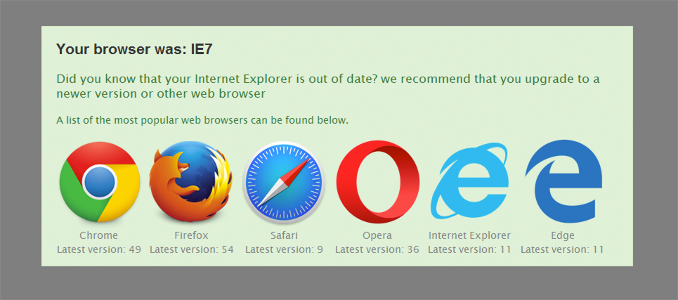

IE Upgrade Warning
===



NOTE: Code base on [ie6-upgrade-warning](http://code.google.com/p/ie6-upgrade-warning/). Thanks to him for a great script.

Chinese: https://git.goovell.com/shionphan/iewarning

## Usage 

Look at the `demo/index.html` file on IE 8 for example.

You can visit http://www.joomla178.com on Internet Explorer 8

Chinese Readme.md [README_CN.md](README_CN.md).

Insert code before `</head>` or `</body>`

```html
<!--[if lt IE 9]>
<script src="localization/en_GB.js"></script>
<script src="warning.min.js"></script>
<script>
    window.onload=function(){
      ieWarning(function() {
        var languageMap = {};
          //specifies a JSON hash table for localization
        if(window.IEWarningLocalizations) {
          languageMap = window.IEWarningLocalizations;
        }
        
        return {
          imgPath: "./", //specifies the path to the icons of each browser, eg: http://www.joomla178.com/templates/joomla178/js/
          localizations:  languageMap
        };
      });
    };
</script>
<![endif]-->
```

## Language & Information

* IE9 and IE10 output the message "msg2s" in localization/xx_XX.js
* IE6, IE7, IE8 output the message "msg2" in localization/xx_XX.js

## Make

> Just compress warning.js and generate a demo dir

install modules(base on grunt, installing grunt @ first)

```
npm install
```

grunt task

```
grunt
```

## License

The MIT License (MIT)
