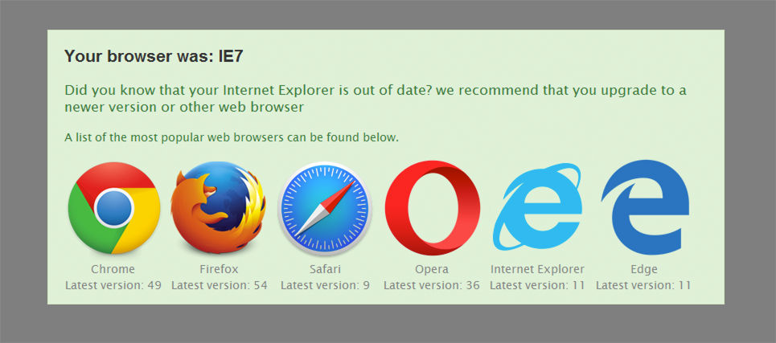

IE升级警告框
===



NOTE: 代码基于[ie6-upgrade-warning](http://code.google.com/p/ie6-upgrade-warning/)，感谢原作者贡献！

## 使用方法

用IE8浏览这个文件：`demo/index.html`。

还可以使用IE8浏览：http://www.joomla178.com

将以下代码插入 `</head>` 或 `</body>` （注意`imgPath`是插件所在目录全址，另注意根据你需要适配的版本修改下述代码`<!--[if lt IE 9]>`

```html
    <!--[if lt IE 9]>
    <script src="localization/en_GB.js"></script>
    <script src="warning.min.js"></script>
    <script>
        window.onload=function(){
          ieWarning(function() {
            var languageMap = {};
              //specifies a JSON hash table for localization
            if(window.IEWarningLocalizations) {
              languageMap = window.IEWarningLocalizations;
            }
            
            return {
              imgPath: "./", //specifies the path to the icons of each browser, eg: http://www.joomla178.com/templates/joomla178/js/
              localizations:  languageMap
            };
          });
        };
    </script>
    <![endif]-->
```

## 自定义语言

* IE9、IE10 显示的内容是`localization/xx_XX.js`中的"msg2s"对应信息
* IE6、IE7、IE8 显示的内容是`localization/xx_XX.js`中的"msg2"对应信息

## 构建

> 仅仅是将warning.js压缩，并生成demo目录

安装模块(基于nodejs的grunt插件，需要先安装grunt)

```
    npm install
```

执行任务

```
    grunt
```

## License

The MIT License (MIT)
